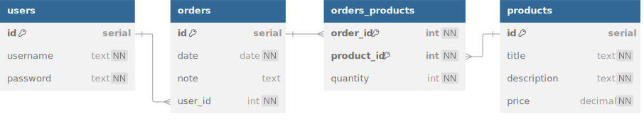

# Market

Market is a versatile and robust e-commerce platform that allows users to browse
and purchase a wide selection of products.

## Database



<details>
<summary>See DBML</summary>

```dbml
table users {
  id serial [pk]
  username text [unique, not null]
  password text [not null]
}

table orders {
  id serial [pk]
  date date [not null]
  note text
  user_id int [not null]
}

table orders_products {
  order_id int [not null]
  product_id int [not null]
  quantity int [not null]

  indexes {
    (order_id, product_id) [pk]
  }
}

table products {
  id serial [pk]
  title text [not null]
  description text [not null]
  price decimal [not null]
}

Ref: users.id < orders.user_id [delete: cascade]
Ref: orders.id < orders_products.order_id [delete: cascade]
Ref: products.id < orders_products.product_id [delete: cascade]
```

</details>

1. Create a new Postgres database named `market`.
2. Create tables in `schema.sql` according to the schema above.
3. Seed the database with at least 1 user who has made at least 1 order of at least
   5 distinct products. There should be at least 10 different products seeded.

## API

Once your database is properly seeded, build an Express app that serves the following routes.

The 🔒 lock icon next to a route indicates that it must be a protected route.
A user can only access that route by attaching a valid token to their request.
If a valid token is not provided, immediately send a 401 Unauthorized error.

`/users` router

- `POST /users/register`
  - sends 400 if request body is missing username or password
  - creates a new user with the provided credentials and sends a token
  - the password should be hashed in the database
- `POST /users/login`
  - sends 400 if request body is missing username or password
  - sends a token if the provided credentials are valid

`/products` router

- `GET /products` sends array of all products
- `GET /products/:id`
  - sends 404 if the product with that id does not exist
  - sends the specific product
- 🔒 `GET /products/:id/orders`
  - sends 404 if the product with that id does not exist (even if the user is logged in!)
  - sends an array of all orders made by the user that include this product

`/orders` router

- 🔒 `POST /orders`
  - sends 400 if request body does not include a `date`
  - creates a new order by the logged-in user and sends it with status 201
- 🔒 `GET /orders` sends array of all orders made by the logged-in user
- 🔒 `GET /orders/:id`
  - sends 404 if the order does not exist
  - sends 403 if the logged-in user is not the user who made the order
  - sends the order with the specified id
- 🔒 `POST /orders/:id/products`
  - sends 404 if the order does not exist
  - sends 403 if the logged-in user is not the user who made the order
  - sends 400 if the request body does not include a `productId` and a `quantity`
  - sends 400 if the `productId` references a product that does not exist
  - adds the specified quantity of the product to the order and sends the created
    `orders_products` record with status 201
- 🔒 `GET /orders/:id/products`
  - sends 404 if the order does not exist
  - sends 403 if the logged-in user is not the user who made the order
  - sends the array of products in the order

## Submission

**Make a pull request** from your fork into the main branch of this starter repo.
The title of your pull request should include your full name. Submit the link
to your _pull request_.
